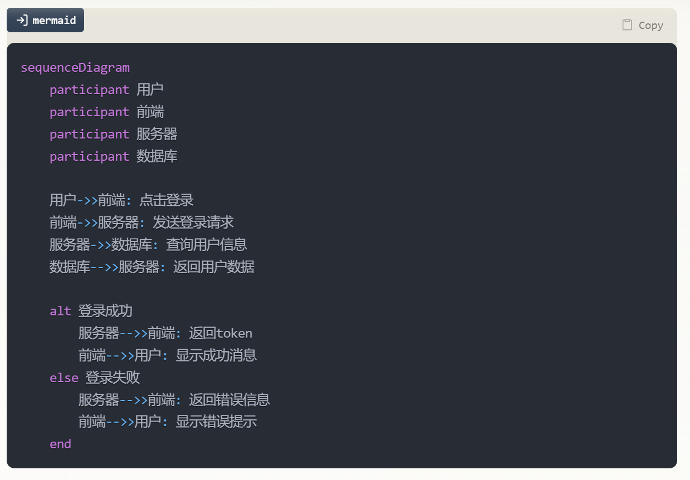
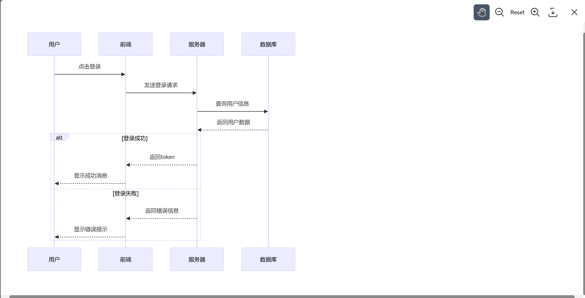

# sansan0/useful-userscripts

> 如果你不小心偶遇 bug，可以提 issues 让我瞧瞧，
> 如果项目凑活的帮到你了，麻烦点个 star ⭐ 给到我点更新的动力呗~

## 前置要求：安装 Tampermonkey

在使用这些脚本之前，你需要先安装 Tampermonkey 浏览器扩展。

### 安装地址

- Chrome：[Chrome 网上应用店](https://chromewebstore.google.com/detail/tampermonkey/dhdgffkkebhmkfjojejmpbldmpobfkfo)
- Edge：[Microsoft Edge 加载项](https://microsoftedge.microsoft.com/addons/detail/tampermonkey/iikmkjmpaadaobahmlepeloendndfphd)

### 开启开发者模式

通过扩展管理页面开启浏览器的开发者模式：

1. Chrome: 访问 `chrome://extensions/`
   Edge: 访问 `edge://extensions/`
2. 在右上角或者左侧找到并开启 "Developer mode"（开发者模式）开关

---

## 脚本列表

| 脚本名称                     | 描述                                                                                  | 源码                                                                 | 文档                              |
| ---------------------------- | ------------------------------------------------------------------------------------- | -------------------------------------------------------------------- | --------------------------------- |
| Claude 对话导出工具          | 将 Claude 对话和附件以 markdown 形式导出                                              | [claude-markdown-exporter.js](claude/claude-markdown-exporter.js)    | [详情](#claude-markdown-exporter) |
| Claude mermaid 图表查看      | 在线查看 Claude 对话中存在的 mermaid 图表                                             | [claude-mermaid-viewer.js](claude/claude-mermaid-viewer.js)          | [详情](#claude-mermaid-viewer)    |
| Bilibili UP 主过滤器         | 过滤屏蔽掉一些 Bilibili UP 主的视频                                                   | [bilibili-up-filter.js](bilibili/bilibili-up-filter.js)              | [详情](#bilibili-up-filter)       |
| 网站在线时长统计(通用)       | 追踪和统计网站访问时长                                                                | [website-time-tracker.js](website-time-tracker.js)                   | [详情](#website-time-tracker)     |
| 控制网页视频的音量和播放速度 | 实现视频音量突破 100%限制（无需调整电脑系统音量）和精确调整播放速度（0.1 倍速为单位） | [video-volume-speed-controller.js](video-volume-speed-controller.js) |                                   |

---

## claude-markdown-exporter

> 一个用于导出 Claude AI 对话内容的增强版脚本。支持完整的对话导出，包括文本附件和图片附件（不包括 pdf 等）

### 参考来源

本脚本参考了 [claude-chat-exporter](https://github.com/agarwalvishal/claude-chat-exporter) ，原项目采用 Console 注入方式实现（在浏览器开发者工具的控制台中复制粘贴运行代码）但因缺少维护现已无法导出正常内容
（其实更好的方式是抓 json ，但都顺着原项目的思路做完了，能凑活用就行

### 功能对比

原始功能:

- [x] 支持代码块导出
- [x] 导出对话内容为 Markdown 格式
- [x] console 注入后直接导出为 claude_conversation.md

新增功能:

- [x] 通过固定的下载按钮下载对话
- [x] 支持文本附件的导出
- [x] 支持图片附件的导出（以 Base64 格式）
- [x] 添加附件统计功能（显示文本和图片附件数量）
- [x] 优化的界面提示（弹窗通知）
- [x] 文件名自动包含 Claude 版本信息和对话名

### 安装和使用

1. 安装 Tampermonkey 浏览器扩展
2. 安装该脚本到 Tampermonkey
3. 访问 Claude 聊天界面，点击右下角的 "Download Conversation" 按钮即可导出对话

### 使用注意

- 导出过程中如有附件，会自动点击打开附件以获取内容
- 图片附件将被转换为 Base64 格式内嵌在 Markdown 文件中
- 导出完成后会显示附件统计信息
- 双击页面任意位置可以关闭统计提示

## claude-mermaid-viewer

> 一个用于 Claude 的用户脚本,提供便捷的 Mermaid 图表查看和交互功能。让 Mermaid 图表展示更加直观、美观。

### 主要功能

- [x] 一键查看 Mermaid 图表
  - 点击代码块左上角的按钮打开查看器
  - 支持缩放、平移等交互操作
- [x] 丰富的图表交互功能
  - [x] 缩放控制
    - 支持放大/缩小图表
    - 一键重置图表大小
  - [x] 平移操作
    - 拖拽移动图表位置
    - 自由调整查看角度
  - [x] 导出功能
    - 支持导出 PNG 格式
    - 保持图表清晰度

### 安装和使用

1. 安装 Tampermonkey 浏览器扩展
2. 安装该脚本到 Tampermonkey
3. 访问 Claude 聊天页面即可使用
4. 使用方式:
   - 当 Claude 输出包含 Mermaid 图表时,点击代码块左上角的按钮
   - 在弹出的查看器中可以:
     - 使用缩放按钮调整图表大小
     - 拖拽移动图表位置
     - 点击下载按钮导出 PNG 图片

### 使用注意

- 仅支持 Claude 中的 Mermaid 图表查看
- 导出的 PNG 图片会保存到本地下载目录
- 支持所有 Mermaid 支持的图表类型
- 图表渲染依赖 Mermaid.js 库,首次使用可能需要加载

---

## bilibili-up-filter

> 一个用于 B 站的用户脚本，提供快速屏蔽和管理 UP 主内容的功能，以及便捷的 UP 主访问方式。

### 主要功能

- [x] 鼠标悬停显示屏蔽选项
- [x] 一键屏蔽/取消屏蔽 UP 主
- [x] 通过输入 UP ID 直接屏蔽
- [x] 自动过滤被屏蔽 UP 主的所有内容
- [x] 右侧固定的三个快捷入口
  - [x] 输入 ID 快速屏蔽
  - [x] 查看已屏蔽列表
    - 支持快速移除屏蔽
    - 屏蔽列表完整管理
    - 支持直接跳转空间
  - [x] 查看关注列表
    - 显示最近关注的 UP 主
    - 支持直接跳转空间，包含关注时间信息

### 安装和使用

1. 安装 Tampermonkey 浏览器扩展
2. 安装该脚本到 Tampermonkey
3. 访问任意 B 站页面即可使用
4. 通过以下方式屏蔽 UP 主：
   - 在 b 站首页，鼠标悬停在 UP 主名字上方，点击屏蔽选项
   - 点击右侧紫色按钮，输入 UP 主 ID 直接屏蔽
   - 视频播放页面的用户顶部有屏蔽选项
5. 通过悬停右侧按钮查看：
   - 已屏蔽 UP 主列表（蓝色按钮）
   - 最近关注列表（粉色按钮）

### 使用注意

- 需要登录 B 站账号才能使用完整功能（最近关注功能）
- 屏蔽列表数据保存在本地，清除浏览器数据会导致丢失
- 通过 ID 屏蔽的 UP 主，在屏蔽列表中初始显示为 ID，不影响过滤效果，当该 UP 主内容出现时首页并过滤成功后会自动更新为昵称

---

## website-time-tracker

> 用于追踪和统计用户在每个二级域名下的在线时长,并提供友好的可视化统计界面(比如 www.bilibili.com 与 space.bilibili.com 是同一个计时器)

### 主要功能

- [x] 实时统计当日在线时长
- [x] 数据使用 GM_setValue 持久化存储
- [x] 支持同一个二级域名下的时间累计
- [x] 悬浮固定显示框
  - 显示当日累计在线时长
  - 支持拖拽定位
  - 支持双击收缩/展开
- [x] 时间格式化显示
  - 自动转换为时分秒格式
  - 实时更新显示
- [x] 图表化数据展示(精确到分钟)
- [x] 支持查看历史统计

### 安装和使用

1. 安装 Tampermonkey 浏览器扩展
2. 安装该脚本到 Tampermonkey
3. 访问任意网页即可在右上角看到计时器
4. 通过以下方式使用：
   - 查看实时计时
   - 拖拽调整位置
   - 双击收缩/展开显示框
   - 点击"查看统计"按钮查看详细数据

---
